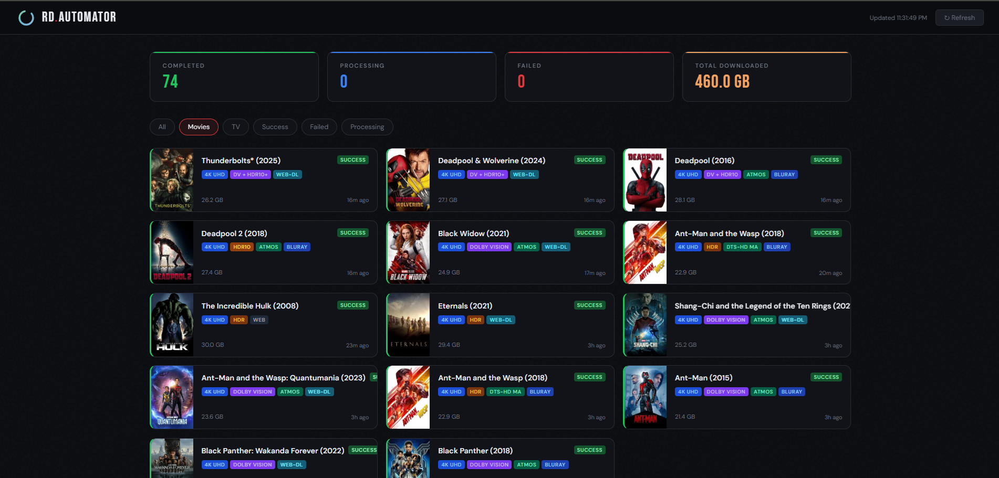
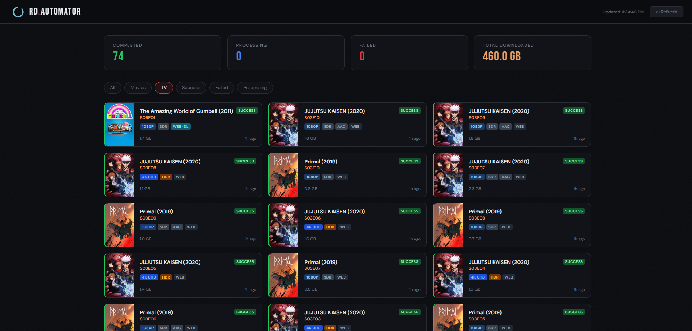

# RD Automator

A self-hosted webhook receiver that automatically finds and downloads movies and TV shows via [Real-Debrid](https://real-debrid.com) when triggered by Radarr or Sonarr. Features a built-in web dashboard with TMDB poster art, quality badges, and persistent download history.




## Features

- **Automatic quality selection** — prefers HDR (Dolby Vision, HDR10+, HDR10) over SDR, highest resolution first
- **Stream validation** — verifies the RD URL resolves to an expected file size before sending to JDownloader
- **Rich badge parsing** — resolution, HDR type, audio format, and source all parsed from stream titles
- **TMDB poster art** — movie and show posters pulled automatically via TMDB API
- **Persistent history** — SQLite database tracks every download with status, size, and metadata
- **Web dashboard** — clean dark UI at `http://your-ip:8888/` with filtering and live stats
- **Supports Radarr, Sonarr, and Sonarr for Anime** — separate webhook endpoints for each

---

## How It Works

1. Radarr/Sonarr fires a webhook on Grab or Movie Added
2. rd-automator queries [Torrentio](https://torrentio.strem.fun) with your RD API key and the IMDB ID
3. Picks the best cached stream matching your quality and size requirements
4. Validates the RD URL resolves to the expected file size
5. Sends the direct download link to JDownloader via MyJDownloader API
6. JDownloader downloads straight to your media folder
7. Radarr/Sonarr detects the completed file via blackhole and auto-imports

---

## Requirements

- [Real-Debrid](https://real-debrid.com) account and API key
- [JDownloader 2](https://jdownloader.org) with [MyJDownloader](https://my.jdownloader.org) account
- Radarr and/or Sonarr
- Docker + Docker Compose
- (Optional) [TMDB API key](https://www.themoviedb.org/settings/api) for poster art

---

## Quick Start

### 1. Clone the repo

```bash
git clone https://github.com/yourusername/rd-automator.git
cd rd-automator
```

### 2. Build the Docker image

```bash
docker build -t rd-automator:latest .
```

### 3. Add to your docker-compose.yml

```yaml
rd-automator:
  image: rd-automator:latest
  container_name: rd-automator
  restart: unless-stopped
  environment:
    - RD_API_KEY=your_real_debrid_api_key
    - MYJ_EMAIL=your_myjdownloader_email
    - MYJ_PASSWORD=your_myjdownloader_password
    - MYJ_DEVICE=JDownloader@Docker
    - MAX_SIZE_GB_MOVIE=30
    - MAX_SIZE_GB_TV=6
    - MIN_QUALITY_MOVIE=2160p
    - MIN_QUALITY_TV=1080p
    - TZ=America/New_York
    - TMDB_API_KEY=your_tmdb_api_key_optional
  ports:
    - "8888:8888"
  volumes:
    - /your/persistent/path:/data
```

### 4. Start the container

```bash
docker compose up -d rd-automator
```

---

## Environment Variables

| Variable | Default | Required | Description |
|---|---|---|---|
| `RD_API_KEY` | — | ✅ | Real-Debrid API token |
| `MYJ_EMAIL` | — | ✅ | MyJDownloader account email |
| `MYJ_PASSWORD` | — | ✅ | MyJDownloader account password |
| `MYJ_DEVICE` | `JDownloader@Docker` | ✅ | Device name in MyJDownloader |
| `MAX_SIZE_GB_MOVIE` | `30` | | Max file size in GB for movies |
| `MAX_SIZE_GB_TV` | `6` | | Max file size in GB for TV episodes |
| `MIN_QUALITY_MOVIE` | `2160p` | | Minimum quality for movies (`2160p`, `1080p`, `720p`, `480p`) |
| `MIN_QUALITY_TV` | `1080p` | | Minimum quality for TV (`2160p`, `1080p`, `720p`, `480p`) |
| `TMDB_API_KEY` | — | | TMDB v3 API key for poster art (optional) |
| `DB_PATH` | `/data/rd-automator.db` | | Path to SQLite database inside container |
| `TZ` | — | | Timezone (e.g. `America/New_York`) |

---

## Webhook Setup

### Radarr
Settings → Connect → + → Webhook
- **Name:** RD Automator
- **Triggers:** On Grab + On Movie Added
- **URL:** `http://rd-automator:8888/webhook/radarr`
- **Method:** POST

### Sonarr
Settings → Connect → + → Webhook
- **Name:** RD Automator
- **Triggers:** On Grab
- **URL:** `http://rd-automator:8888/webhook/sonarr`
- **Method:** POST

### Sonarr (Anime)
Same as Sonarr but point to:
- **URL:** `http://rd-automator:8888/webhook/sonarr-anime`

---

## API Endpoints

| Endpoint | Method | Description |
|---|---|---|
| `/` | GET | Web dashboard |
| `/health` | GET | Health check and config status |
| `/api/history` | GET | JSON download history |
| `/api/stats` | GET | JSON stats (success/failed/total GB) |
| `/webhook/radarr` | POST | Radarr webhook receiver |
| `/webhook/sonarr` | POST | Sonarr webhook receiver |
| `/webhook/sonarr-anime` | POST | Sonarr anime webhook receiver |
| `/test/<imdb_id>` | GET | Test stream selection for a movie |
| `/test/send/<imdb_id>` | GET | Test stream selection and send to JDownloader |

### Test with an IMDB ID
```
http://your-ip:8888/test/tt0371746
```
*(Iron Man)*

### Health check
```
http://your-ip:8888/health
```

---

## Getting Your API Keys

**Real-Debrid API key:**
real-debrid.com → Account → API token

**MyJDownloader:**
Sign up at my.jdownloader.org, install JDownloader 2, link your account in JDownloader settings

**TMDB API key (optional):**
themoviedb.org → Settings → API → Request an API key (free)

---

## Stream Selection Logic

Streams are selected using the following priority:

1. Must meet minimum quality threshold (`MIN_QUALITY_MOVIE` / `MIN_QUALITY_TV`)
2. Must not exceed maximum size (`MAX_SIZE_GB_MOVIE` / `MAX_SIZE_GB_TV`)
3. HDR streams preferred over SDR (Dolby Vision → HDR10+ → HDR10 → HDR → SDR)
4. Within the same HDR tier, highest quality then largest size wins
5. Each candidate URL is validated via HTTP HEAD request to confirm it resolves to the expected file size before being sent to JDownloader
6. If a stream fails validation, the next best candidate is tried automatically

---

## Persistent Storage

The SQLite database is stored at `DB_PATH` inside the container (`/data/rd-automator.db` by default). Mount a persistent volume to preserve download history across container restarts and updates:

```yaml
volumes:
  - /your/host/path:/data
```

---

## License

MIT
